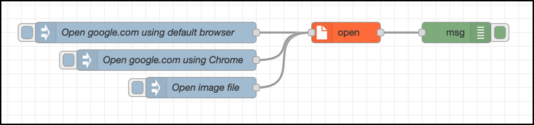
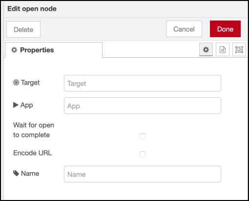
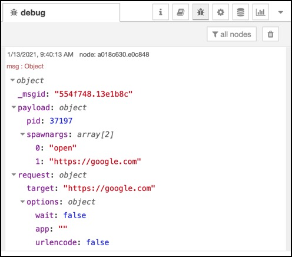

# node-red-contrib-open

## About

This node is used to open web pages, documents and other files in the computer where Node-RED is running.

Unless a specific application is specified, the node opens items using the default application for the item in question.  
For example:

* URLs are opened using the defaualt browser.
* .jpg images in the host computers file system are opened using the default image viewer application.
* Excel documents are opened using Excel.
* ...

It's also possible to specify that a particular app should be used when opening the item, i.e. overriding the default app.

## Sample use cases

### Open web page

Have your Node-RED flow open a certain web page in response to something happening.

Maybe a button being pressed should trigger some actions within Node-RED, one being to open a web status page in a browser.

### Open image viewer

Your Node-RED flow generates or somehow triggers the creation of one or more image files, and you want to show these to the user.

## Installation

The node can be installed from the Node-RED palette or from the command line, like any other Node-RED node.

## Usage

When a message arrives on the input the node will open the item specified by the `target` field.

Available options are:

* `wait`: Wait until the open command has completed. The exact behaviour vary between OSs and apps, but most likely the node's output won't trigger until the opened app closes. Boolean (true/false).
* `app`: Used to specify that the item should be opened using a specific app rather than the default app.  
  Note that the app name is platform dependent. For example, Chrome is `google chrome` on macOS, `google-chrome` on Linux and `chrome` on Windows. You may also pass in the app's full path.
* `urlencode`: If target is a URL and the `urlencode` open is `true`, URL encoding will be done before sending the URL to the associated application. Booleans (true/false).

All values above can be specified in either the incoming message or in the properties of the node itself.  
If a value is specified in both the incoming message and the node's property, the incoming message's value will be used.

### Sample flow



```json
[{"id":"3a58f425.e5ae4c","type":"open","z":"96a7b122.182a38","name":"","target":"","app":"","wait":false,"urlencode":false,"x":1010,"y":700,"wires":[["a018c630.e0c848"]]},{"id":"26b5b81b.5db13","type":"inject","z":"96a7b122.182a38","name":"Open google.com using default browser","props":[{"p":"target","v":"https://google.com","vt":"str"}],"repeat":"","crontab":"","once":false,"onceDelay":0.1,"topic":"","x":720,"y":700,"wires":[["3a58f425.e5ae4c"]]},{"id":"a018c630.e0c848","type":"debug","z":"96a7b122.182a38","name":"","active":true,"tosidebar":true,"console":false,"tostatus":false,"complete":"true","targetType":"full","statusVal":"","statusType":"auto","x":1170,"y":700,"wires":[]},{"id":"f3dcdb06.f800a","type":"inject","z":"96a7b122.182a38","name":"Open image file","props":[{"p":"target","v":"/path/to/image.jpeg","vt":"str"}],"repeat":"","crontab":"","once":false,"onceDelay":0.1,"topic":"","x":800,"y":780,"wires":[["3a58f425.e5ae4c"]]},{"id":"f55de952.472738","type":"inject","z":"96a7b122.182a38","name":"Open google.com using Chrome","props":[{"p":"target","v":"https://google.com","vt":"str"},{"p":"app","v":"google chrome","vt":"str"}],"repeat":"","crontab":"","once":false,"onceDelay":0.1,"topic":"","x":750,"y":740,"wires":[["3a58f425.e5ae4c"]]}]
```

### Node properties

In addition to the node properties (target and its options) mentioned above, the node has a Name property similar to other Node-RED nodes:



### Outgoing message

The outgoing message contains both a copy of the inoming message (=request) and some results from the opening of the item.

When opening google.com using the default browser (see sample flow above), the outgoing message looks like this:



## Dependencies

The node relies on the [open](https://www.npmjs.com/package/open) module for all interactions with the host computer.
Properties from the node are passed straight through to the open module, whose documentation thus can be useful to understand what can be done.

## Limitations

This node can only open items in the host computer where Node-RED is running.

* If running Node-RED natively on a computer, this node can open items (URLs, files etc) on that computer.
* If running Node-RED as a Docker container, this node will open items in that Docker container. Which is probably not what's desired when it comes to opening web pages, showing images in image viewers etc.

It's actually quite likely that an attempt to use this node from within Node-RED running in a Docker container will just fail, as the Node-RED container won't have a web browser, document viewer etc.
